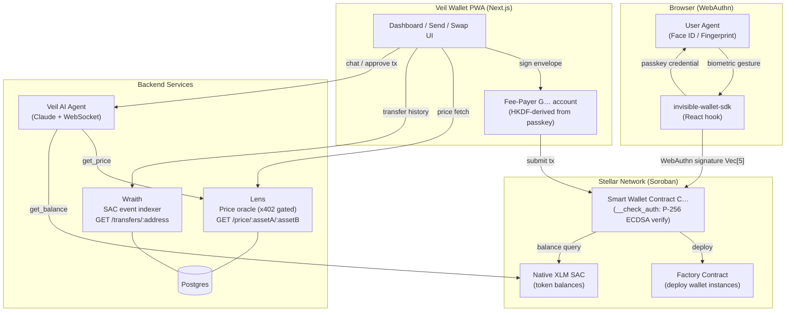

# Veil

[](https://github.com/Miracle656/veil/actions/workflows/ci.yml)
[](https://opensource.org/licenses/MIT)
[](https://stellar.org)
[](CONTRIBUTING.md)

A passkey-powered smart wallet on the Stellar Soroban blockchain. Users authenticate with their device biometrics (Face ID, fingerprint, Windows Hello) instead of seed phrases or private keys.

## How it works

Veil combines WebAuthn (the browser passkey standard) with a Soroban custom account contract. When a user registers, a P-256 keypair is created on their device and the public key is stored in the wallet contract. To authorize a transaction, the user's device signs the Soroban authorization payload with their passkey. The contract verifies the full WebAuthn assertion on-chain — including the challenge binding and the ECDSA signature — before approving any action.

```
User device                        Stellar network
──────────────────────────────     ─────────────────────────────
1. register()
   └─ WebAuthn credential create
   └─ extract P-256 public key ──► deploy wallet contract
                                        └─ store public key

2. signAuthEntry(payload)
   └─ WebAuthn assertion
   └─ DER → raw sig conversion
   └─ return {pubkey, authData,
      clientDataJSON, sig}    ────► __check_auth()
                                        └─ verify challenge in clientDataJSON == payload
                                        └─ compute SHA256(authData || SHA256(clientDataJSON))
                                        └─ verify P-256 ECDSA signature
                                        └─ approve / reject
```

## Architecture



> See [docs/adr/0001-two-account-model.md](docs/adr/0001-two-account-model.md) for the design rationale behind the `C…` + `G…` two-account model.
> See [docs/adr/0002-webauthn-signature-verification.md](docs/adr/0002-webauthn-signature-verification.md) for the full WebAuthn on-chain verification pipeline.

## Project structure

```
veil/
├── contracts/
│   ├── invisible_wallet/          # Soroban smart contract (Rust)
│   │   ├── src/
│   │   │   ├── lib.rs             # Contract entry points + __check_auth
│   │   │   ├── auth.rs            # WebAuthn ES256 verification logic
│   │   │   └── storage.rs         # Signer and guardian storage
│   │   └── Cargo.toml
│   └── factory/                   # Factory contract — deploys wallet instances
│       ├── src/
│       │   ├── lib.rs             # init(wasm_hash) + deploy(pubkey, rp_id, origin)
│       │   ├── storage.rs         # WasmHash + Deployed(salt) keys
│       │   └── validation.rs      # P-256 public key validation
│       └── Cargo.toml
├── sdk/
│   ├── src/
│   │   ├── useInvisibleWallet.ts  # React hook — register, deploy, login, signAuthEntry, addSigner, removeSigner, setGuardian, initiateRecovery, completeRecovery
│   │   ├── webauthn.ts            # WebAuthn provider interface + web/browser implementation
│   │   ├── webauthn.native.ts     # React Native implementation (react-native-passkey) — Metro auto-resolves
│   │   ├── utils.ts               # Crypto utilities (DER→raw, pubkey extraction, SHA256, computeWalletAddress)
│   │   └── index.ts               # Package exports
│   └── package.json
├── packages/
│   └── agent/                     # Veil AI Agent (Node.js / TypeScript)
│       └── src/
│           ├── agent.ts           # Claude tool-use loop (get_price, get_balance, build_swap, build_payment, request_user_approval)
│           ├── server.ts          # Express + WebSocket server — handles chat messages, conversation history
│           ├── txBuilder.ts       # Builds unsigned Stellar XDR transactions (swap, payment)
│           └── x402Client.ts      # x402 micropayment client — auto-pays Lens price endpoint calls
└── frontend/
    ├── website/                   # Next.js 14 marketing site (veil-mocha.vercel.app)
    │   └── app/
    │       ├── page.tsx           # Homepage — Hero, HowItWorks, WhyVeil, DevQuickstart
    │       └── products/          # /products listing + /wallet /lens /wraith /agent detail pages
    ├── docs/                      # Nextra 3 documentation (veil-2ap8.vercel.app)
    └── wallet/                    # Veil wallet app (Next.js 14, veil-ezry.vercel.app)
        ├── app/
        │   ├── dashboard/         # Balance, all token assets with logos, activity feed + filters (All/Transfers/Swaps)
        │   ├── send/              # Send XLM or tokens — passkey-gated
        │   ├── swap/              # SDEX path payment swap — passkey-gated
        │   ├── agent/             # AI chat UI — WebSocket to Agent server
        │   ├── token/[code]/      # Individual token page: sparkline chart, balance, filtered txn history, actions
        │   ├── contacts/          # Address book
        │   ├── settings/          # App settings
        │   ├── recover/           # Guardian recovery flow
        │   └── lock/              # Inactivity lock screen — biometric re-auth
        ├── components/            # VeilLogo, TxDetailSheet, ContactPicker, QrScanner
        ├── hooks/                 # useInactivityLock
        └── lib/                   # txState.ts (mid-tx lock guard), passkeyAuth.ts (shared biometric gate)
```

## Services

| Service    | Description                                               | Deployed                           |
| ---------- | --------------------------------------------------------- | ---------------------------------- |
| **Lens**   | Price oracle — SDEX + AMM prices, x402 micropayment gated | <https://lens-ldtu.onrender.com>   |
| **Wraith** | SAC event indexer — transfer history for Soroban wallets  | <https://wraith-0jo1.onrender.com> |
| **Agent**  | Claude AI agent — chat, swap, payments, balance queries   | <https://veil-agent.onrender.com>  |

### Lens (unified\_price\_api)

Fastify/Prisma/Postgres oracle that ingests SDEX trades and AMM pool snapshots from Stellar. Exposes `GET /price/:assetA/:assetB` gated behind x402 micropayments (auto-paid by the agent). Deployed on Render, data stored in Supabase PostgreSQL.

### Wraith

Express/Prisma/Postgres indexer for Stellar Soroban contract events. Fills the Horizon gap for incoming SAC token transfers that classic payment endpoints miss.

Key endpoint: `GET /transfers/address/:address?direction=incoming|outgoing|both&limit=N`

Additional endpoints: `GET /summary/:address`, `GET /transfers/address/:address` with `fromDate`/`toDate`/`eventType` filters.

### Agent (packages/agent)

Claude-powered AI agent embedded in the Veil wallet. Connects via WebSocket. Tools:

| Tool                    | Description                                                       |
| ----------------------- | ----------------------------------------------------------------- |
| `get_price`             | Fetches live SDEX/AMM price via Lens (x402 auto-paid)             |
| `get_wallet_balance`    | Fetches XLM + token balances via Horizon                          |
| `get_transfer_history`  | Fetches transfer history via Wraith + Horizon payments            |
| `build_swap`            | Builds unsigned path payment XDR (auto-adds trustline if missing) |
| `build_payment`         | Builds unsigned payment XDR                                       |
| `request_user_approval` | Sends transaction to wallet UI for passkey biometric approval     |

All transactions built by the agent are returned unsigned to the frontend, where the user approves with Face ID / fingerprint before the transaction is signed and submitted.

## Tech stack

| Layer          | Technology                                                        |
| -------------- | ----------------------------------------------------------------- |
| Smart contract | Rust, Soroban SDK, p256 crate (ECDSA), sha2                       |
| Authentication | WebAuthn / FIDO2 (ES256 / P-256)                                  |
| Client SDK     | TypeScript, React hooks, @stellar/stellar-sdk v15, Web Crypto API |
| Wallet app     | Next.js 14 App Router, next-pwa                                   |
| AI Agent       | Node.js, Claude claude-sonnet-4-6, Anthropic SDK, WebSocket       |
| Price oracle   | Fastify, Prisma, Postgres (Supabase), x402 micropayments          |
| Indexer        | Express, Prisma, Postgres (Render managed), stellar-sdk v15       |
| Blockchain     | Stellar (Soroban smart contracts, testnet)                        |

## Getting started

### Prerequisites

- [Rust](https://rustup.rs/) with the `wasm32-unknown-unknown` target
- [Stellar CLI](https://developers.stellar.org/docs/tools/stellar-cli)
- Node.js 18+

### Build the contract

```bash
cd contracts/invisible_wallet
cargo build --target wasm32-unknown-unknown --release
```

### Run contract tests

```bash
cd contracts/invisible_wallet
cargo test
```

### Build the SDK

```bash
cd sdk
npm install
npm run build
```

### React Native / Expo

The SDK ships a platform-split WebAuthn layer.  Metro automatically resolves
`webauthn.native.ts` over `webauthn.ts` when bundling for iOS/Android.

**Platform requirements:** iOS 16+, Android 13+ (physical device required).

#### Install peer dependencies

```bash
npm install react-native-passkey @react-native-async-storage/async-storage
# iOS only — re-run pod install after adding the native module:
npx pod-install
```

#### Usage

```tsx
import AsyncStorage from '@react-native-async-storage/async-storage';
import { useInvisibleWallet } from 'invisible-wallet-sdk';

const wallet = useInvisibleWallet({
  factoryAddress:    'CABC...',
  rpcUrl:            'https://soroban-testnet.stellar.org',
  networkPassphrase: 'Test SDF Network ; September 2015',
  rpId:   'your-domain.com',     // required for React Native (no window.location)
  origin: 'https://your-domain.com',
  storage: AsyncStorage,         // replaces localStorage
});
```

`rpId` and `origin` must match your app's associated domain
(`apple-app-site-association` on iOS / `assetlinks.json` on Android).

#### Expo example

```bash
cd examples/expo
cp .env.example .env.local   # fill in factory address + RP details
npm install
npx expo run:ios              # physical device
```

See [`examples/expo/README.md`](examples/expo/README.md) for full setup instructions.

#### Metro resolution

The `react-native` field in `sdk/package.json` points to the TypeScript source
so Metro can apply its `.native.ts` extension resolution:

```json
"react-native": "src/index.ts"
```

No extra Babel plugins are needed when using Expo (which handles TypeScript
via `babel-preset-expo`) or standard `@react-native/metro-config`.

### Run the agent locally

```bash
cd packages/agent
cp .env.example .env  # fill in AGENT_KEYPAIR_SECRET, ANTHROPIC_API_KEY, ORACLE_URL, WRAITH_URL
npm install
npm run build
npm start
```

The agent exposes:

- `GET /health` — health check
- `WS /` — WebSocket chat endpoint (expects `{ type: 'chat', walletAddress, feePayerAddress, message }`)

## Usage

### With React

```tsx
import { useInvisibleWallet } from 'invisible-wallet-sdk';

function App() {
  const wallet = useInvisibleWallet({
    factoryAddress: FACTORY_CONTRACT_ID,
    rpcUrl: 'https://soroban-testnet.stellar.org',
    networkPassphrase: Networks.TESTNET,
  });

  // Register a passkey and deploy a wallet contract
  await wallet.register('alice');
  const { walletAddress } = await wallet.deploy();

  // Sign a Soroban authorization entry
  const sig = await wallet.signAuthEntry(signaturePayload); // Uint8Array (32 bytes)
  // sig = { publicKey, authData, clientDataJSON, signature }
  // Encode sig as Vec<Val> and attach to the Soroban auth entry

  // Multi-signer management
  await wallet.addSigner(newPublicKey);
  await wallet.removeSigner(signerIndex);

  // Guardian recovery
  await wallet.setGuardian(guardianPublicKey);
  await wallet.initiateRecovery(newPublicKey);
  await wallet.completeRecovery(); // after 3-day timelock
}
```

### Without a framework

```js
import { createInvisibleWallet } from 'invisible-wallet-sdk/vanilla';

// Initialize wallet
const wallet = createInvisibleWallet({
  factoryAddress: FACTORY_CONTRACT_ID,
  rpcUrl: 'https://soroban-testnet.stellar.org',
  networkPassphrase: 'Test SDF Network ; September 2015',
});

// Register a passkey and deploy a wallet contract
const { walletAddress } = await wallet.register('alice');
await wallet.deploy(feePayerKeypair);

// Sign a Soroban authorization entry
const sig = await wallet.signAuthEntry(signaturePayload);

// All methods return Promises - no React hooks or JSX required
```

## Signature format

The contract's `__check_auth` expects the signature field to be a `Vec<Val>` with four elements:

| Index | Type         | Description                                                                          |
| ----- | ------------ | ------------------------------------------------------------------------------------ |
| 0     | `BytesN<65>` | Uncompressed P-256 public key (`0x04 \|\| x \|\| y`)                                 |
| 1     | `Bytes`      | WebAuthn `authenticatorData`                                                         |
| 2     | `Bytes`      | WebAuthn `clientDataJSON` (must contain `base64url(signature_payload)` as challenge) |
| 3     | `BytesN<64>` | Raw P-256 ECDSA signature (`r \|\| s`)                                               |

## Roadmap

- [x] Phase 1 — Contract compiles, error types, ECDSA verification, unit tests
- [x] Phase 2 — Full WebAuthn pipeline (DER→raw, real pubkey extraction, challenge binding)
- [x] Phase 3 — Factory contract + deterministic wallet deployment
- [x] Phase 4 — RP ID / origin verification, testnet integration (smoke test)
- [x] Phase 5 — Guardian recovery, multi-signer, nonce/replay protection
- [x] Wallet app — Dashboard, send, swap, contacts, lock screen, PWA, onboarding tutorial
- [x] Token pages — Individual asset pages with sparkline chart, filtered txn history, actions
- [x] Lens oracle — Live SDEX + AMM prices, x402 micropayment gated
- [x] Wraith indexer — Soroban SAC transfer history (combined endpoint PR #6 merged)
- [x] Agent — Claude AI assistant: balance, prices, swaps, payments — all passkey-gated
- [x] Marketing website — Products section with individual pages for all 4 products

## License

MIT

<br />

Thank you 
