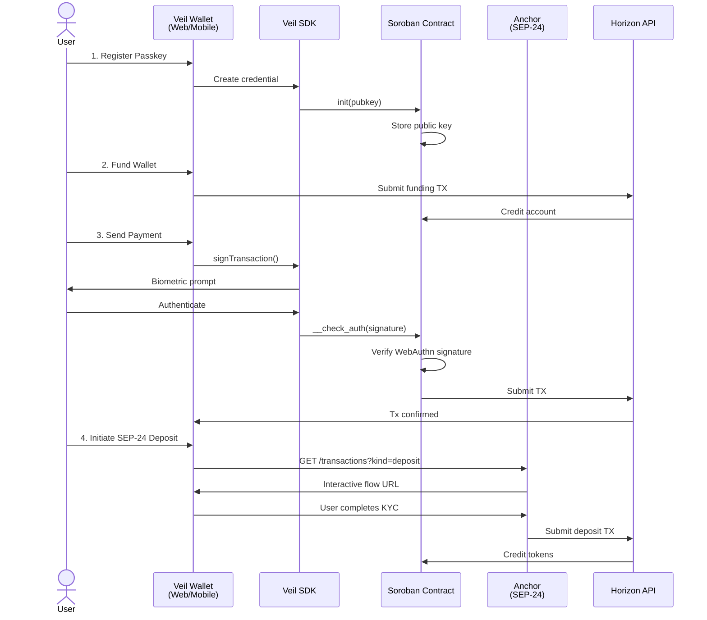
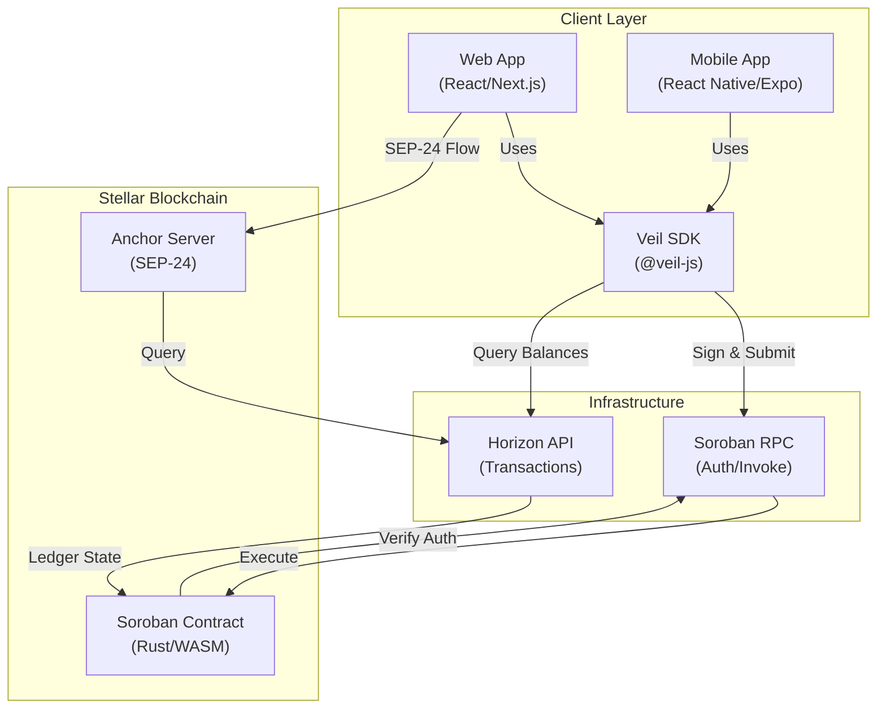

import { Callout } from 'nextra/components'

# Architecture

Veil combines two standards — **WebAuthn (FIDO2)** and **Stellar Soroban custom account contracts** — to create a fully self-custodied wallet that requires no seed phrases.

## Sequence Diagram: Register → Fund → Send → SEP-24 Deposit



## Component Diagram: Architecture Boundary



## High-Level Overview

```
User Device                         Stellar Blockchain (Soroban)
────────────────────────────        ──────────────────────────────────
Browser / Native App                Soroban Runtime
 │                                        │
 │  navigator.credentials.create()        │
 │  → P-256 keypair in secure enclave     │
 │  → 65-byte public key extracted        │
 │                                        │
 │  init(pubkey) ─────────────────────────▶ Store pubkey in contract
 │                                        │
 ├── SIGN FLOW ──────────────────         │
 │                                        │
 │  signaturePayload (32 bytes) ◀─────── Soroban constructs auth entry
 │                                        │
 │  navigator.credentials.get()           │
 │  challenge = signaturePayload           │
 │  → user touches fingerprint            │
 │  → authData + clientDataJSON + sig     │
 │                                        │
 │  Vec<Val>[pubkey, authData,            │
 │    clientDataJSON, sig] ──────────────▶ __check_auth()
 │                                        │  ├─ challenge_is_present()
 │                                        │  ├─ SHA256(authData || SHA256(cDJ))
 │                                        │  └─ P-256 ECDSA verify
 │                                        │
 │                          Ok(()) ◀───── Transaction proceeds
```

## Registration Flow

### 1. Key Generation

```typescript
const credential = await navigator.credentials.create({
  publicKey: {
    challenge: crypto.getRandomValues(new Uint8Array(32)),
    rp: { name: 'Veil Wallet', id: window.location.hostname },
    user: { id: userId, name: username, displayName: username },
    pubKeyCredParams: [{ type: 'public-key', alg: -7 }], // ES256
    authenticatorSelection: {
      userVerification: 'required',
      residentKey: 'preferred',
    },
  },
})
```

The browser/OS generates a **P-256 (secp256r1) key pair** inside the device's secure enclave (TPM, Secure Enclave, etc.). The private key never leaves the hardware.

### 2. Public Key Extraction

```typescript
const pubkey = await extractP256PublicKey(
  credential.response as AuthenticatorAttestationResponse
)
// Returns 65 bytes: 0x04 || x (32B) || y (32B) — uncompressed SEC1
```

### 3. Contract Initialization

```typescript
await contract.init(pubkey) // BytesN<65> stored on-chain
```

## Signing Flow

### 1. Soroban Auth Entry

Before executing a transaction, Soroban calls `__check_auth` with a `signature_payload` — a 32-byte hash derived from the authorization context (contract address, function, args, nonce).

### 2. WebAuthn Assertion

```typescript
const assertion = await navigator.credentials.get({
  publicKey: {
    challenge: signaturePayload, // The exact 32-byte payload
    allowCredentials: [{ id: credentialId, type: 'public-key' }],
    userVerification: 'required',
  },
})
```

<Callout type="info">
  Using `signaturePayload` directly as the WebAuthn challenge is the key design decision. The authenticator embeds `base64url(challenge)` into `clientDataJSON`, which the contract then verifies. This prevents the signature from being used for any other transaction.
</Callout>

### 3. DER to Raw Conversion

WebAuthn returns signatures in **ASN.1 DER** format. The contract expects **raw concatenation** (r || s, 64 bytes):

```typescript
// DER: 30 <len> 02 <rLen> <r> 02 <sLen> <s>
const rawSig = derToRawSignature(assertion.response.signature)
// Output: Uint8Array(64) — r (32B) || s (32B)
```

## `__check_auth` Verification Pipeline

This is called by the Soroban runtime automatically for every transaction.

```rust
pub fn __check_auth(
    env: Env,
    signature_payload: BytesN<32>,   // 32-byte hash from Soroban
    signature: Val,                   // Vec<Val>[4]
    _auth_contexts: Vec<Context>,
) -> Result<(), WalletError>
```

### Step 1 — Signature format validation

The `signature` val must decode to a `Vec<Val>` with exactly 4 elements:

| Index | Type | Content |
|---|---|---|
| 0 | `BytesN<65>` | Uncompressed P-256 public key |
| 1 | `Bytes` | WebAuthn `authenticatorData` |
| 2 | `Bytes` | WebAuthn `clientDataJSON` |
| 3 | `BytesN<64>` | Raw ECDSA signature (r \|\| s) |

### Step 2 — Signer authorization check

```rust
if !storage::has_signer(&env, &pub_key) {
    return Err(WalletError::SignerNotAuthorized)
}
```

### Step 3 — WebAuthn verification (`auth::verify_webauthn`)

```rust
// 1. Challenge binding
let encoded = base64url_encode_32(signature_payload.as_slice());
if !challenge_is_present(&client_data_json, &encoded) {
    return Err(WalletError::InvalidChallenge)
}

// 2. Message hash — matches what the authenticator signed
let client_data_hash = sha256(&client_data_json);
let message = sha256(&[auth_data, client_data_hash].concat());

// 3. ECDSA verify
let verifying_key = VerifyingKey::from_sec1_bytes(&pub_key)?;
verifying_key.verify_prehash(&message, &signature)?;
```

## Data Structures

### WebAuthn `authenticatorData` binary layout

```
 0..32   rpIdHash     — SHA-256 of the Relying Party ID (e.g. "localhost")
32..33   flags        — UP (bit 0), UV (bit 2), AT (bit 6), ED (bit 7)
33..37   signCount    — 4-byte big-endian counter (anti-clone)
37..     extensions   — optional CBOR extension data
```

### `clientDataJSON` structure

```json
{
  "type": "webauthn.get",
  "challenge": "<base64url(signaturePayload)>",
  "origin": "https://your-app.com",
  "crossOrigin": false
}
```

## Storage Design

```rust
enum DataKey {
    Signer(BytesN<65>),  // Persistent storage per key
    Guardian,            // Instance storage (Phase 5)
}
```

Signers use **persistent storage** — they survive ledger expiry extensions and contract upgrades. Guardian uses **instance storage** to stay tightly coupled to the contract instance lifetime.

## Error Hierarchy

```rust
pub enum WalletError {
    AlreadyInitialized,        // init() called twice
    InvalidSignatureFormat,    // Vec<Val> wrong length/types
    SignerNotAuthorized,       // pubkey not in storage
    InvalidPublicKey,          // Can't parse SEC1 bytes
    InvalidSignature,          // Can't parse r||s bytes
    SignatureVerificationFailed, // ECDSA check failed
    InvalidChallenge,          // signaturePayload not in clientDataJSON
}
```
